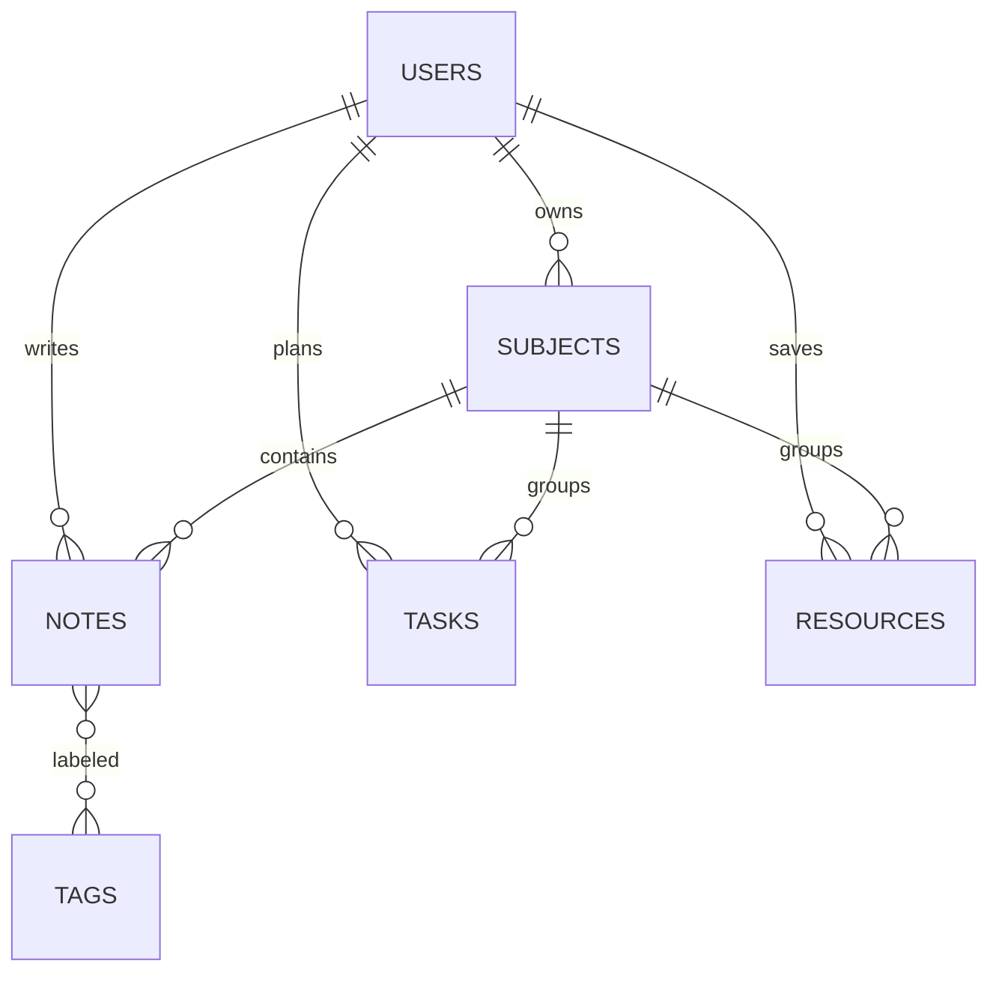

# Database Design

```mermaid
erDiagram
  USERS ||--o{ SUBJECTS : owns
  USERS ||--o{ NOTES : writes
  USERS ||--o{ TASKS : plans
  USERS ||--o{ RESOURCES : saves
  SUBJECTS ||--o{ NOTES : contains
  SUBJECTS ||--o{ TASKS : groups
  SUBJECTS ||--o{ RESOURCES : groups
  NOTES }o--o{ TAGS : labeled
```
